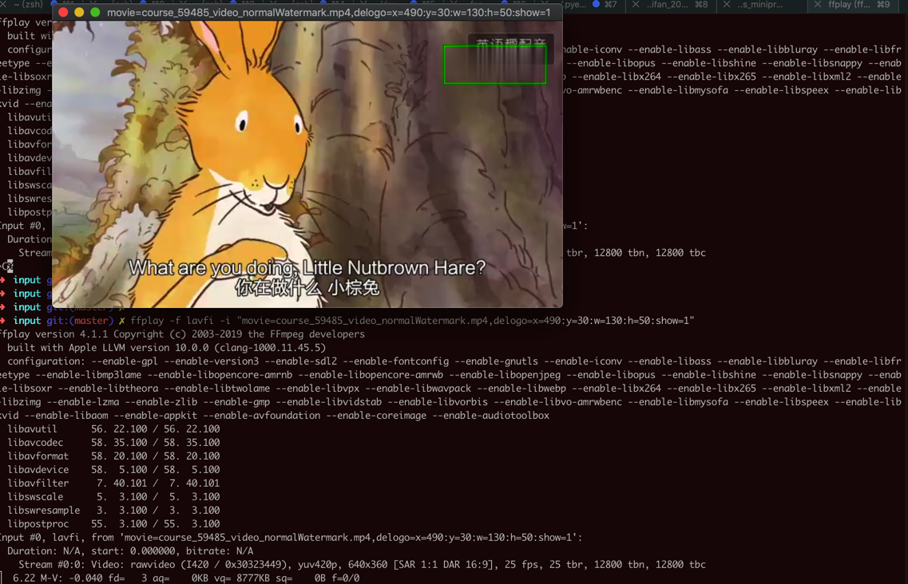
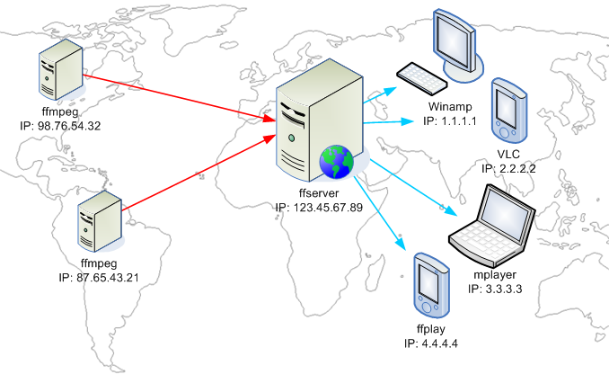

# FFmpeg相关

## ffmpeg与相关的ffprobe，ffplay，ffserver的区别

* ffmpeg：处理音视频
* ffprobe：检测音视频 -》 获取相关文件的属性和信息
* ffplay：播放音视频及其他一些辅助功能
  * 辅助功能举例：
    * 播放视频并显示水印位置：便于发现水印位置是否准确
      ```bash
      ffplay -f lavfi -i "movie=course_59485_video_normalWatermark.mp4,delogo=x=490:y=30:w=130:h=50:show=1"
      ```
      * 播放效果：
      * 
      * -》方便看出要去除的水印的位置有偏差
        * 可以后续再调整参数值，让去除水印的区域更加准确
* ffserver：搭建流媒体服务器 -》用来支持其他端去播放音视频
  * 
