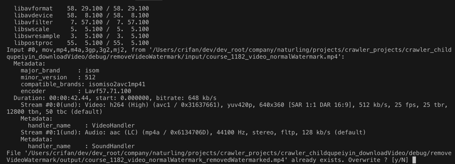

# ffmpeg使用心得

此处整理ffmpeg的一些使用心得。

## 报错：[AVFilterGraph @ 0x7fa224608740] No such filter: 'ass'

```bash
ffmpeg -i CTT_Folge_01_CH_Subs_DefaultZhcnButNotShow.mp4 -vf "ass=subtitle.ass" addedAssSubtitle.mp4
```

报错：

```bash
[AVFilterGraph @ 0x7fa224608740] No such filter: 'ass'
```

原因：此处ffmpeg（没有subtitles，也）没有ass的filter

办法：

重新安装支持了ass的ffmpeg

具体步骤：

Mac

```bash
brew reinstall ffmpeg --with-libass
```

## 报错：Error: Calling keg_only :provided_pre_mountain_lion is disabled! There is no replacement

重新安装ffmpeg期间：

```bash
ffmpeg_edit_subtitle brew reinstall ffmpeg \
    --with-tools \
    --with-fdk-aac \
    --with-freetype \
    --with-fontconfig \
    --with-libass \
    --with-libvorbis \
    --with-libvpx \
    --with-opus \
    --with-x265
```

报错：

```bash
Error: Calling keg_only :provided_pre_mountain_lion is disabled! There is no replacement.
```

解决办法：

先去更新brew再升级ffmpeg

```bash
brew update && brew upgrade ffmpeg
```

再去：

```bash
brew reinstall ffmpeg 加上你的要的参数
```

即：

```bash
brew reinstall ffmpeg \
    --with-tools \
    --with-fdk-aac \
    --with-freetype \
    --with-fontconfig \
    --with-libass \
    --with-libvorbis \
    --with-libvpx \
    --with-opus \
    --with-x265
```

## ffmpeg不显示头部信息

用ffmpeg去处理视频等过程中，每次运行命令，都会输出ffmpeg版本等信息

举例：

```bash
# ffmpeg  -nostdin -i /root/xxx/course/32145/course_32145_video.mp4 -vf "delogo=x=474:y=6:w=162:h=90" -c:a copy /root/xxx/course/32145/course_32145_video_removedWatermark.mp4
ffmpeg version 4.2-static https://johnvansickle.com/ffmpeg/  Copyright (c) 2000-2019 the FFmpeg developers
  built with gcc 6.3.0 (Debian 6.3.0-18+deb9u1) 20170516
  configuration: --enable-gpl --enable-version3 --enable-static --disable-debug --disable-ffplay --disable-indev=sndio --disable-outdev=sndio --cc=gcc-6 --enable-fontconfig --enable-frei0r --enable-gnutls --enable-gmp --enable-libgme --enable-gray --enable-libfribidi --enable-libass --enable-libfreetype --enable-libmp3lame --enable-libopencore-amrnb --enable-libopencore-amrwb --enable-libopenjpeg --enable-librubberband --enable-libsoxr --enable-libspeex --enable-libsrt --enable-libvorbis --enable-libopus --enable-libtheora --enable-libvidstab --enable-libvo-amrwbenc --enable-libvpx --enable-libwebp --enable-libx264 --enable-libx265 --enable-libxml2 --enable-libxvid --enable-libzimg
  libavutil      56. 31.100 / 56. 31.100
  libavcodec     58. 54.100 / 58. 54.100
  libavformat    58. 29.100 / 58. 29.100
  libavdevice    58.  8.100 / 58.  8.100
  libavfilter     7. 57.100 /  7. 57.100
  libswscale      5.  5.100 /  5.  5.100
  libswresample   3.  5.100 /  3.  5.100
  libpostproc    55.  5.100 / 55.  5.100
Input #0, mov,mp4,m4a,3gp,3g2,mj2, from '/root/xxx/course/32145/course_32145_video.mp4':
  Metadata:
    major_brand     : isom
    minor_version   : 512
    compatible_brands: isomiso2avc1mp41
    creation_time   : 2015-11-16T08:09:13.000000Z
    encoder         : Lavf57.71.100
  Duration: 00:00:46.00, start: 0.000000, bitrate: 678 kb/s
    Stream #0:0(und): Video: h264 (High) (avc1 / 0x31637661), yuv420p, 640x360 [SAR 1:1 DAR 16:9], 544 kb/s, 25 fps, 25 tbr, 12800 tbn, 50 tbc (default)
    Metadata:
      creation_time   : 2015-11-16T08:09:13.000000Z
      handler_name    : VideoHandler
    Stream #0:1(und): Audio: aac (LC) (mp4a / 0x6134706D), 44100 Hz, stereo, fltp, 128 kb/s (default)
    Metadata:
      creation_time   : 2015-11-16T08:09:13.000000Z
      handler_name    : SoundHandler
Stream mapping:
  Stream #0:0 -> #0:0 (h264 (native) -> h264 (libx264))
  Stream #0:1 -> #0:1 (copy)
[libx264 @ 0xce0e540] using SAR=1/1
[libx264 @ 0xce0e540] using cpu capabilities: MMX2 SSE2Fast SSSE3 SSE4.2 AVX FMA3 BMI2 AVX2 AVX512
[libx264 @ 0xce0e540] profile Progressive High, level 3.0, 4:2:0, 8-bit
[libx264 @ 0xce0e540] 264 - core 157 r2969 d4099dd - H.264/MPEG-4 AVC codec - Copyleft 2003-2019 - http://www.videolan.org/x264.html - options: cabac=1 ref=3 deblock=1:0:0 analyse=0x3:0x113 me=hex subme=7 psy=1 psy_rd=1.00:0.00 mixed_ref=1 me_range=16 chroma_me=1 trellis=1 8x8dct=1 cqm=0 deadzone=21,11 fast_pskip=1 chroma_qp_offset=-2 threads=6 lookahead_threads=1 sliced_threads=0 nr=0 decimate=1 interlaced=0 bluray_compat=0 constrained_intra=0 bframes=3 b_pyramid=2 b_adapt=1 b_bias=0 direct=1 weightb=1 open_gop=0 weightp=2 keyint=250 keyint_min=25 scenecut=40 intra_refresh=0 rc_lookahead=40 rc=crf mbtree=1 crf=23.0 qcomp=0.60 qpmin=0 qpmax=69 qpstep=4 ip_ratio=1.40 aq=1:1.00
Output #0, mp4, to 
......
```

中的：

```bash
ffmpeg version 4.2-static https://johnvansickle.com/ffmpeg/  Copyright (c) 2000-2019 the FFmpeg developers
  built with gcc 6.3.0 (Debian 6.3.0-18+deb9u1) 20170516
  configuration: --enable-gpl --enable-version3 --enable-static --disable-debug --disable-ffplay --disable-indev=sndio --disable-outdev=sndio --cc=gcc-6 --enable-fontconfig --enable-frei0r --enable-gnutls --enable-gmp --enable-libgme --enable-gray --enable-libfribidi --enable-libass --enable-libfreetype --enable-libmp3lame --enable-libopencore-amrnb --enable-libopencore-amrwb --enable-libopenjpeg --enable-librubberband --enable-libsoxr --enable-libspeex --enable-libsrt --enable-libvorbis --enable-libopus --enable-libtheora --enable-libvidstab --enable-libvo-amrwbenc --enable-libvpx --enable-libwebp --enable-libx264 --enable-libx265 --enable-libxml2 --enable-libxvid --enable-libzimg
  libavutil      56. 31.100 / 56. 31.100
  libavcodec     58. 54.100 / 58. 54.100
  libavformat    58. 29.100 / 58. 29.100
  libavdevice    58.  8.100 / 58.  8.100
  libavfilter     7. 57.100 /  7. 57.100
  libswscale      5.  5.100 /  5.  5.100
  libswresample   3.  5.100 /  3.  5.100
  libpostproc    55.  5.100 / 55.  5.100
```

这部分内容。

如果觉得很麻烦，想要禁止其输出，可以加上参数：

`-hide_banner`

用于禁止显示banner，即可。

## ffmpeg不显示输出的众多的普通的信息

另外，如果对于处理期间输出的众多内容，不想要显示，则可以加：

`-loglevel error`

用于设置当输出的信息，超过error，才显示

而上面信息都是属于普通的info级别，低于error，所以就不显示

起到控制不显示普通的输出的信息的效果了

注：

ffmpeg输出信息的等级：

* `quiet`
* `panic`
* `fatal`
* `error`
* `warning`
* `info`
* `verbose`
* `debug`

## ffmpeg强制覆盖输出文件

ffmpeg强制覆盖输出文件 = 不需要当每次检测到已存在文件再提示你是否要覆盖

用ffmpeg时，如果输出文件已存在，默认不会覆盖，会提示你：

```bash
File xxx.mp4 already exists. Overwrite ? [y/N]
```

要输入y，才可以继续：



如果不想要提示，而是强制覆盖源文件，则可以加上参数：

`-y`

相关参数含义：

```bash
# ffmpeg --help
...
-y                  overwrite output files
```
