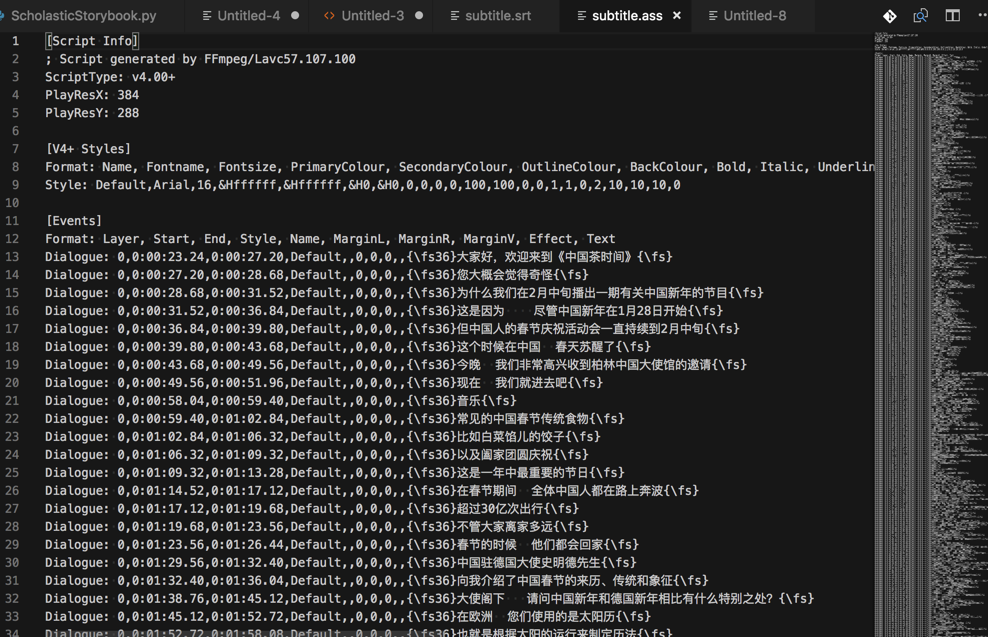

# 字幕格式

## ASS

* Advanced SubStation Alpha=ASS
  * 一句话描述：一种比SSA更先进的字幕脚本格式
    * 之前的格式 SSA
      * 全称：SubStation Alpha
        * 或 Sub Station Alpha
      * 由 CS Low（亦作 Kotus）创建
      * 特点
        * 比传统字幕（如SRT）更加强大先进的字幕文件格式。
        * 该格式在Windows平台上可以经播放器由VSFilter渲染进行播放。这是一款广受欢迎且已停止开发的字幕编辑制作工具。
      * 最新版本：V4.00
  * 基于：SSA 4.00+编码构建
  * 特点：
    * 在SSA编写风格的基础上增添更多的效果和指令
  * 使用现状
    * 该字幕格式常被字幕组所应用
      * 目前有很多播放器支持渲染SSA、ASS字幕
  * 最新版本：V4.00+
  * ASS字幕分类
    * 软字幕
      * 特点
        * 过程可逆
          * 可以提取、取出和查看源代码的
      * 包含
        * 内挂字幕
          * 一般指字幕文件与视频一同封装在MKV文件中，播放时需经过VSFilter渲染
        * 外挂字幕
          * 字幕文件以单独形式存在，播放时经VSFilter渲染到视频上
    * 内嵌字幕
      * 指字幕被以图形方式硬编码到视频中
        * 变成视频数据本身=视频数据的一部分
      * 特点
        * 过程不可逆
          * 无法再把字幕提取出来
        * 播放时不需VSFilter等渲染
  * 常用字幕制作软件
    * Aegisub
    * Jubler
    * VisualSubSync
    * subtitleeditor
    * Sabbu
    * Sub Station Alpha tool 
    * Subtitle Workshop
    * Subtitle Processor 
    * Miyu
    * Gaupol
  * ASS格式详解
    * 脚本说明
      * Script Info: 脚本的一般全局信息:
        * Title：标题
        * Original Script：脚本原作
        * Script Updated By：脚本优化
        * Script Type：类型
          * 用于兼容性设置
            * SSA=4.00
            * ASS=4.00+
        * PlayResX & PlayResY：屏幕宽高
        * PlayDepth：决定颜色数量
        * Timer：定时器
      * V4 Styles: 定义文字样式，在events部分可以直接调用这些样式。
        * PrimaryColour：第一颜色，即文字本身的颜色
        * SecondaryColour：第二颜色
          * 在卡拉OK时使用，卡拉OK指令会用第一颜色填充第二颜色。
        * TertiaryColour：边框色，文字边框的颜色
          * ASS中称为OutlineColour
        * BackColour：阴影颜色，文字阴影的颜色
        * MarginL, MarginR. 左右缩进。文字距离视频最左最右的最小距离。
        * MarginV： 上下缩进。
          * 文字热点（对齐点）距离视频上下的最小间距离。这取决于文字对齐方式，如果该文字使用中对齐，则上下缩进值无效。需要时文字可用\n或\N命令换行。ASS文件中，Script Info部分的一个参数“WrapStyle”也可以改变此值
        * Outline：边框样式
          * 文字可以设定为有边框，无边框，或拥有不透明边框（矩形背景）
        * Shadow：阴影距离
          * 文字的阴影到文字的距离大小
        * AlphaLevel.：透明度（0至255有效）
        * Encoding：ASCII码中的文字编码方式
        * Alignment：对齐方式
          * 含义：画面中位置的对齐方式，按照数字键盘区布局
          * 取值范围：1-9
            * 具体效果，参考此图：
              * 
          * 默认：2
            * 底部居中
    * Events: 字幕的主体部分
      * 字幕的出现时间和样式、对样式的修改和特效
        * 语法格式为：
          * {\命令(参数，多个参数用逗号隔开)}
            * 例如
              * {\move(80,80,200,200,150,300)}
              * 只有一个参数的命令不需要括号 (如. {\kf89})
      * 注意
        * 一对大括号内可以放置多个语句
          * 如
            * {\bord8\be1}
        * \N 和 \n 命令不需要在两边加大括号就可使用

### ass字幕文件举例

举例1：



举例2：`input/5d41d82f52247ce73d40475b.ass`

内容是

```ini
[Script Info]
; Script generated by FFmpeg/Lavc58.54.100
ScriptType: v4.00+
PlayResX: 384
PlayResY: 288

[V4+ Styles]
Format: Name, Fontname, Fontsize, PrimaryColour, SecondaryColour, OutlineColour, BackColour, Bold, Italic, Underline, StrikeOut, ScaleX, ScaleY, Spacing, Angle, BorderStyle, Outline, Shadow, Alignment, MarginL, MarginR, MarginV, Encoding
Style: Default,Arial,16,&Hffffff,&Hffffff,&H0,&H0,0,0,0,0,100,100,0,0,1,1,0,2,10,10,10,0

[Events]
Format: Layer, Start, End, Style, Name, MarginL, MarginR, MarginV, Effect, Text
Dialogue: 0,0:00:02.68,0:00:09.16,Default,,0,0,0,,I'm a policeman in the town. All day long,I walk around!\N我是镇上的警察 整天都在巡视
Dialogue: 0,0:00:09.18,0:00:15.86,Default,,0,0,0,,I'm a policeman in the town. All day long, I walk around!\N我是镇上的警察 整天都在巡视
...
Dialogue: 0,0:02:04.21,0:02:10.82,Default,,0,0,0,,It's my job. It's what I do. It's my job. I like it, too!\N牛奶员我的工作 这就是我的工作 牛奶员我的工作 我也很喜欢这份工作
```


## srt

* `srt`=`subtitle`

### 举例

中英文双字幕：

```ini
1
00:00:02,000 --> 00:00:06,700
Careful now, I don't want to hurt you.
现在要小心了 我可不想伤到你啊
 
2
00:00:10,500 --> 00:00:14,550
So Mr. Teacher guy, as the real Dragon Warrior,
那么 这个作为神龙斗士老师的你
 
3
00:00:14,560 --> 00:00:17,950
I say to you, Shakabooey!
我想对你说 滚你的
 
4
00:00:24,500 --> 00:00:28,030
So, guess you can start planning my parade now.
那 我想你们可以开始我的游行了是吧
```

英文（单字幕）：

```ini
1
00:00:02,310 --> 00:00:04,677
I am a little turtle
 
2
00:00:04,752 --> 00:00:07,540
I crawl so slow
 
3
00:00:07,670 --> 00:00:12,120
I carry my house wherever I go.
 
4
00:00:12,210 --> 00:00:16,927
When I get tired, I put in my head,
```
