# Aegisub

* `Aegisub`
  * 概述：字幕编辑工具
  * 主页
    * Aegisub Advanced Subtitle Editor
      * http://www.aegisub.org

## 用Aegisub编辑字幕

从[官网](http://www.aegisub.org)

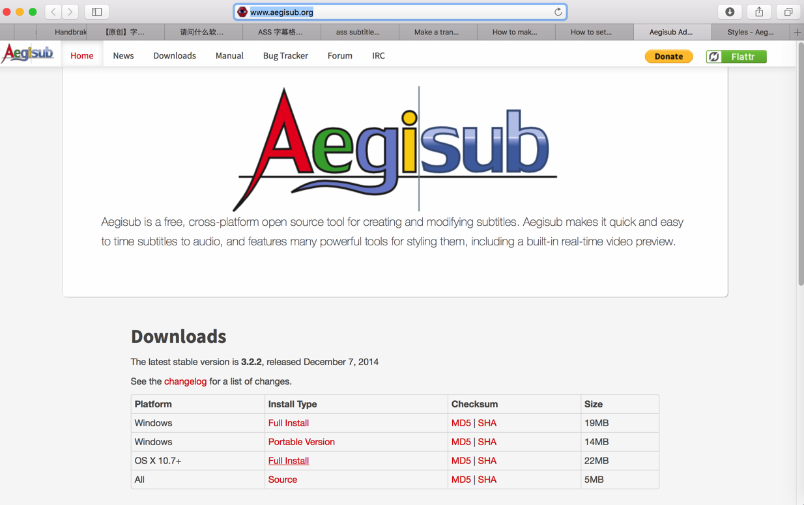

下载对应版本：

`Aegisub-3.2.2.dmg`

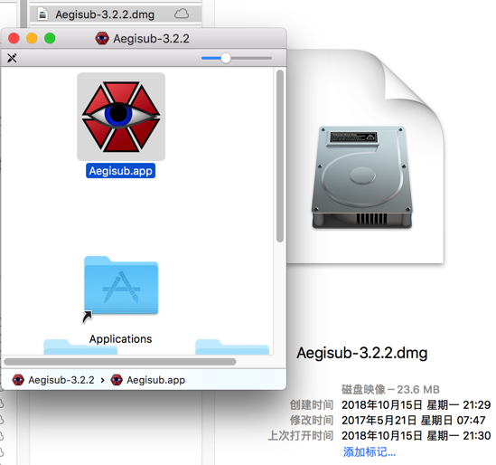

去安装，然后打开

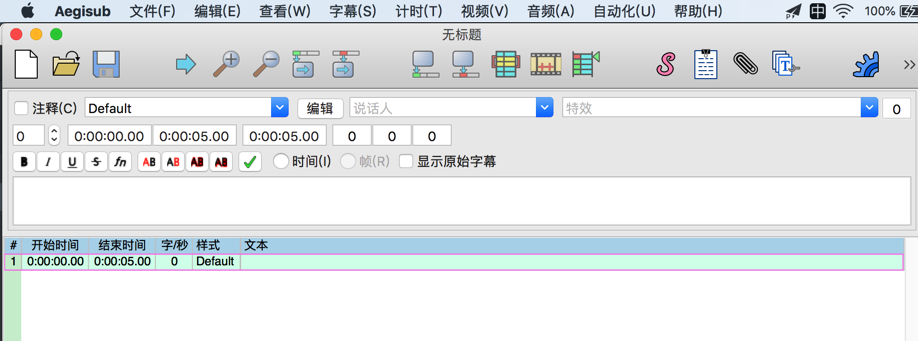

先去打开你的字幕文件，此处的ass文件：

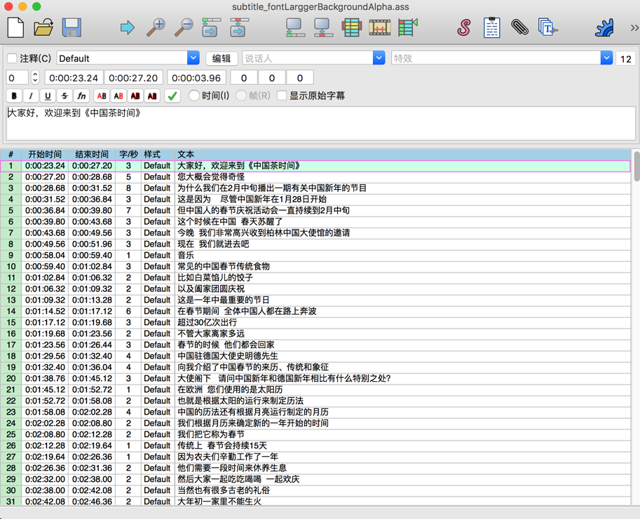

字幕-》样式管理器-》去编辑 当前脚本 中的，比如默认有个：Default 的样式

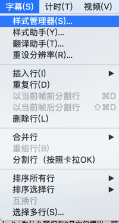

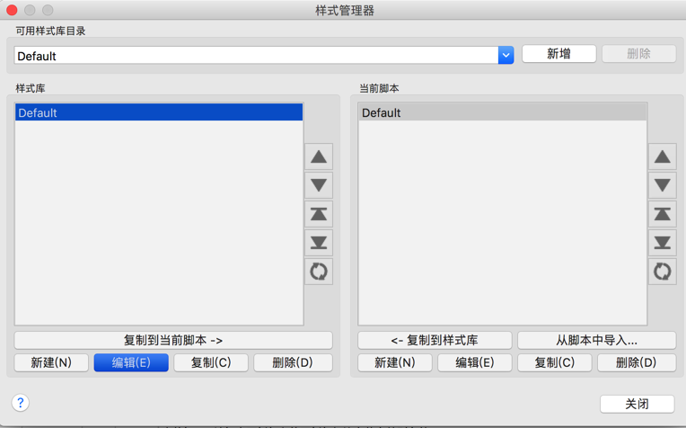

就出来字幕预览了：

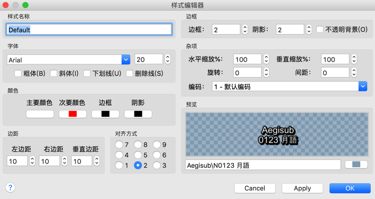

参数解释：

* 半透明效果
  * 先勾选 边框-》不透明效果
  * 再去：颜色-》 点击：边框 或 阴影，弹出设置框，改动你要的颜色，尤其是调整 透明度

从左边的 样式库 中 默认的样式：Default，选中，点击下面的 复制到当前脚本

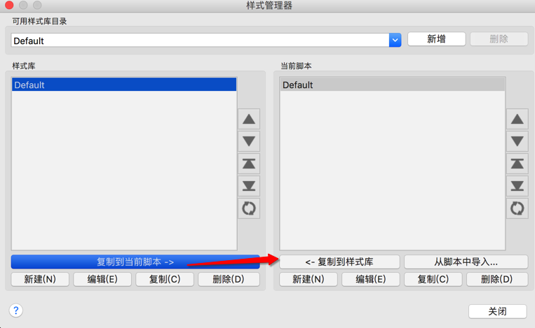

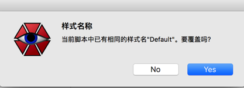

然后再去放大，即可以看到效果了：

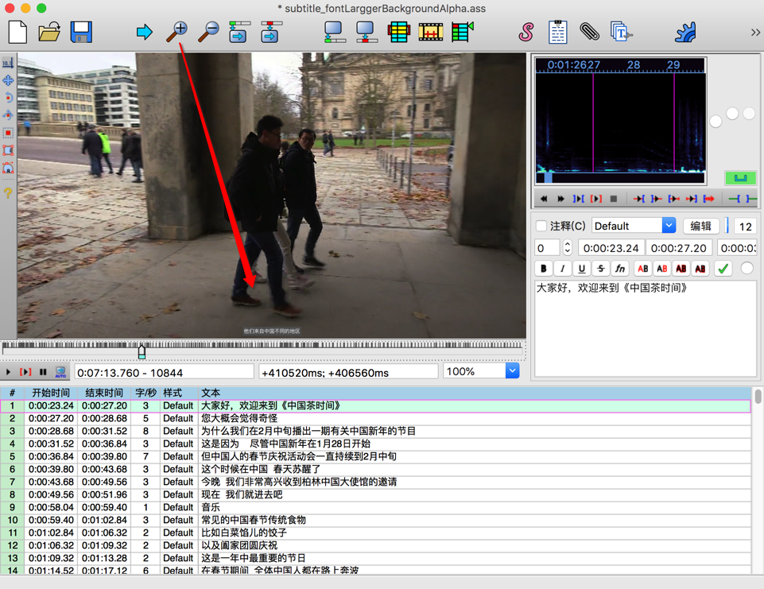

继续编辑字幕

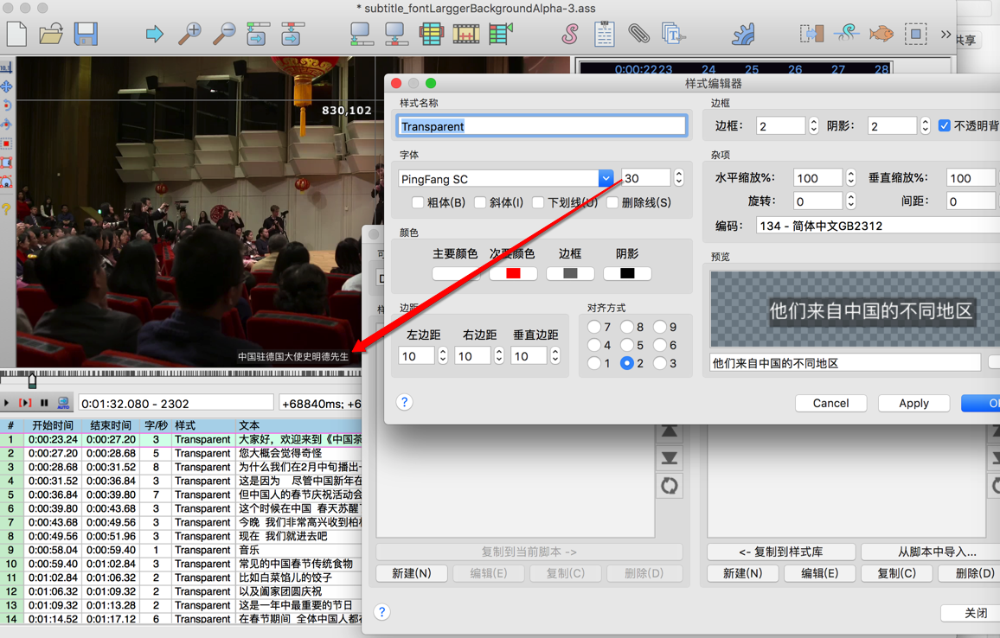


直到调节出你要的效果。

编辑好ass后，另存为，得到最终的ass文件。

具体过程详见：

【已解决】用Aegisub字幕编辑器去调整字体大小和字幕背景半透明效果

## 举例

* 输入=编辑前

此处之前从某mp4视频中用ffmpeg提取出srt，在用ffmpeg从srt转换出ass字幕

```bash
[Script Info]
; Script generated by FFmpeg/Lavc58.18.100
ScriptType: v4.00+
PlayResX: 384
PlayResY: 288

[V4+ Styles]
Format: Name, Fontname, Fontsize, PrimaryColour, SecondaryColour, OutlineColour, BackColour, Bold, Italic, Underline, StrikeOut, ScaleX, ScaleY, Spacing, Angle, BorderStyle, Outline, Shadow, Alignment, MarginL, MarginR, MarginV, Encoding
Style: Default,Arial,36,&Hffffff,&Hffffff,&H0,&H0,0,0,0,0,100,100,0,0,1,1,0,2,10,10,10,0
```

* 编辑字幕

用Aegisub编辑字幕，，调整出我要的效果后，另存为保存出的ass文件

把其配置：

```bash
Style: Transparent,PingFang SC,20,&H00FFFFFF,&H000000FF,&HBC5E5E5E,&H8B000000,0,0,0,0,100,100,0,0,3,0,1,2,10,10,10,134
```

换进来即可

* 输出=编辑后

```bash
[Script Info]
; Script generated by FFmpeg/Lavc58.18.100
ScriptType: v4.00+
PlayResX: 384
PlayResY: 288

[V4+ Styles]
Format: Name, Fontname, Fontsize, PrimaryColour, SecondaryColour, OutlineColour, BackColour, Bold, Italic, Underline, StrikeOut, ScaleX, ScaleY, Spacing, Angle, BorderStyle, Outline, Shadow, Alignment, MarginL, MarginR, MarginV, Encoding
Style: Transparent,PingFang SC,20,&H00FFFFFF,&H000000FF,&HBC5E5E5E,&H8B000000,0,0,0,0,100,100,0,0,3,0,1,2,10,10,10,134

[Events]
Format: Layer, Start, End, Style, Name, MarginL, MarginR, MarginV, Effect, Text
Dialogue: 0,0:00:23.24,0:00:27.20,Transparent,,0,0,0,,大家好，欢迎来到xxx
```

* 核心配置

就一句：

```bash
Style: Transparent,PingFang SC,20,&H00FFFFFF,&H000000FF,&HBC5E5E5E,&H8B000000,0,0,0,0,100,100,0,0,3,0,1,2,10,10,10,134
```

起到了配置字幕属性，实现了效果：

* 字体：PingFang SC
* 字体大小：20
* 字幕的背景半透明效果：后面很多参数组合的效果

## 常见问题

### 当导入视频时会提示：载入视频的分辨率与当前脚本指定的分辨率不匹配

* 不要用默认选择：直接设为视频分辨率
  * 会导致预览看到的视频很小，字幕很小
    * 后续调整字幕的大小后，预览中视频里的字幕仍旧很小，导致字幕字体大小无法生效
* 重新选这个：重设脚本分辨率
  * 但是也会导致另存为的ass文件中，有视频方面的设置
    * 我是后来自己参考原始的配置，改回去为原始的配置的

