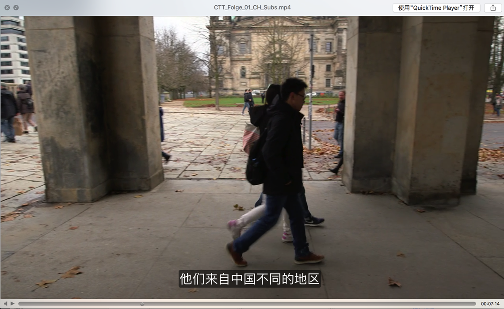

# 指定字幕文字属性

此处介绍嵌入字幕时，指定字幕文字的各种属性，比如`字体大小`、`字体类型`、`颜色`、`透明度`等

* srt字幕：加force_style参数
    ```bash
    ffmpeg -i video.mp4 -vf "subtitles=subs.srt:force_style='Fontsize=24,PrimaryColour=&H0000ff&'" -c:a copy output.mp4
    ```
* ass字幕：在ass字幕中设置参数
    ```bash
    Fontname, Fontsize, PrimaryColour, SecondaryColour, OutlineColour, BackColour, Bold, Italic, Underline, StrikeOut, ScaleX, ScaleY, Spacing, Angle, BorderStyle, Outline, Shadow
    ```

具体设置成什么值，以及效果如何，可借助于软件Aegisub去设置和预览

### 举例1

```bash
Style: Transparent,PingFang SC,20,&H00FFFFFF,&H000000FF,&HBC5E5E5E,&H8B000000,0,0,0,0,100,100,0,0,3,0,1,2,10,10,10,134
```

实现了字幕效果：

* 字体：PingFang SC
* 字体大小：20
* 字幕的背景半透明效果：后面很多参数组合的效果

如图：



### 举例2：ass设置半透明的背景

```bash
Style: Default,Arial,16,&H00FFFFFF,&H000000FF,&H80000000,&H80000000,-1,0,0,0,100,100,0,0,4,0,0,2,10,10,10,1
```

即可达到要的字幕有个半透明的背景色了。

其中`16`指的是`字体大小`，可以根据需要更改为自己要的值。
