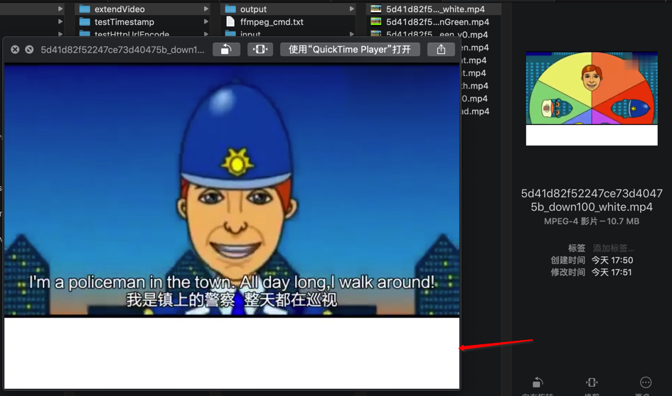
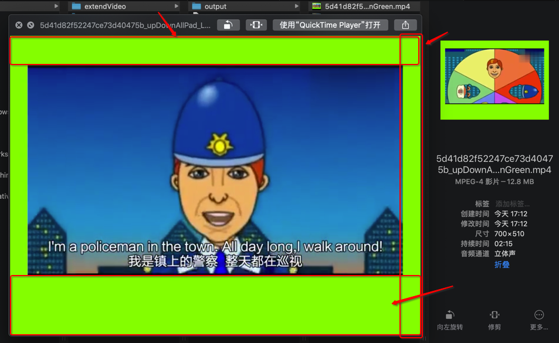

# 尺寸调整

## 缩放视频尺寸

```bash
ffmpeg -i big.mov -vf scale=360:-1  small.mov
```

* 注意
  * `scale`值必须是偶数，这里的`-1`表示保持长宽比，根据宽度值自适应高度
  * 如果要求压缩出来的视频尺寸长宽都保持为偶数，可以使用`-2`

## extend扩大视频高度（和宽度）

* 注意：此处改变视频宽高，是`调整`=`extend`=`enlarge`=`扩大`或`缩小`，不是`等比例缩放`=`resize`

思路：用`ffmpeg`的`pad`参数去指定要扩大的宽度和高度

参数详解：


* `pad`=`padding`：增加视频区域，即宽度和（或）高度
  * `width`和`height`：（增加了padding后的）输出的视频的宽度和高度
    * 值的方式
      * 固定的数值
      * 表达式
        * 可以借用内置支持的常量或变量
          * 比如
            * 输入的原始视频的
              * 宽度：`in_w`=`iw`
              * 高度：`in_h`=`ih`
            * 输出的padding后的视频的
              * 宽度：`out_w`=`ow`
              * 高度：`out_h`=`oh`
  * x和y：
    * 原始视频，放在输出后的视频的位置
    * 默认：`0`和`0`
      * 特殊
        * 如果（`x`或`y`）是负数，则效果是（水平方面或垂直方向）自动居中

### 用法举例

* 输入：原始视频 480x360
* 输出

#### 希望：宽度不变，高度在下面增加100，背景色是白色

命令：

```bash
ffmpeg -i input.mp4 -vf "pad=width=0:height=460:x=0:y=0:color='White" output.mp4
```

参数说明：

* 高度
  * 可以用数值：`460`
  * 也可以用表达式：`ih+100`
    ```bash
    ffmpeg -i input.mp4 -vf "pad=width=0:height=ih+100:x=0:y=0:color='White" output.mp4
    ```

效果：



#### 希望：调整多个属性

希望：

* 高度：上面增加`50`，下面增加`100`
  * 总增加高度=`50+100`=`150`
* 宽度：左右都增加`30`，原视频居中
  * 总增加宽度=`30*2`=`60`
* 背景色：`LawnGreen`
* 透明度：`0.2`

命令：

* pad中的值用手动计算出的值：
    ```bash
    ffmpeg -i input.mp4 -vf "pad=width=540:height=510:x=30:y=50:color='LawnGreen@0.5" output.mp4
    ```
* 或：pad中的值尽量用表达式：
    ```bash
    ffmpeg -i input.mp4 -vf "pad=width=iw+60:height=ih+150:x=-1:y=50:color='LawnGreen@0.5" output.mp4
    ```

效果：



附录：

前面折腾期间的命令记录，包括出错的命令：

```bash
ffmpeg -i input/5d41d82f52247ce73d40475b.mp4 -vf "pad=width=640:height=360:x=0:y=40:color=black" output/5d41d82f52247ce73d40475b_afterPad.mp4

ffmpeg -i input/5d41d82f52247ce73d40475b.mp4 -vf "pad=width=640:height=400:x=0:y=360:color=black" output/5d41d82f52247ce73d40475b_afterPad_191610.mp4

ffmpeg -i input/5d41d82f52247ce73d40475b.mp4 -vf "pad=width=0:height=400:x=0:y=360:color=black" output/5d41d82f52247ce73d40475b_afterPad_autoWidth.mp4

ffmpeg -i input/5d41d82f52247ce73d40475b.mp4 -vf "pad=width=0:height=400:x=0:y=360:color=0x00" output/5d41d82f52247ce73d40475b_afterPad_autoWidth_transparent.mp4

ffmpeg -i input/5d41d82f52247ce73d40475b.mp4 -vf "pad=width=0:height=400:x=0:y=360:color='0x00" output/5d41d82f52247ce73d40475b_afterPad_autoWidth_transparent.mp4

ffmpeg -i input/5d41d82f52247ce73d40475b.mp4 -vf "pad=width=0:height=400:x=0:y=360:color='White@0.0" output/5d41d82f52247ce73d40475b_afterPad_autoWidth_transparent.mp4

ffmpeg -i input/5d41d82f52247ce73d40475b.mp4 -vf "pad=width=0:height=460:x=0:y=360:color='White" output/5d41d82f52247ce73d40475b_afterPad_autoWidth_moreHeight.mp4

ffmpeg -i input/5d41d82f52247ce73d40475b.mp4 -vf "pad=width=iw:height=ih+100:x=0:y=ih:color='SeaGreen@0.2" output/5d41d82f52247ce73d40475b_afterPad_autoWH_SeaGreen.mp4

ffmpeg -i input/5d41d82f52247ce73d40475b.mp4 -vf "pad=width=iw:height=ih+80:x=0:y=0:color='SeaGreen@0.2" output/5d41d82f52247ce73d40475b_afterPad_autoWH_SeaGreen_y0.mp4

ffmpeg -i input/5d41d82f52247ce73d40475b.mp4 -vf "pad=width=iw+60:height=ih+150:x=-1:y=50:color='LawnGreen@0.5" output/5d41d82f52247ce73d40475b_upDownAllPad_LawnGreen.mp4

ffmpeg -i input/5d41d82f52247ce73d40475b.mp4 -vf "pad=width=0:height=460:x=0:y=0:color='White" output/5d41d82f52247ce73d40475b_down100_white.mp4
```

供参考。
