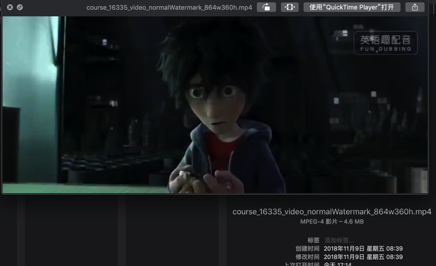
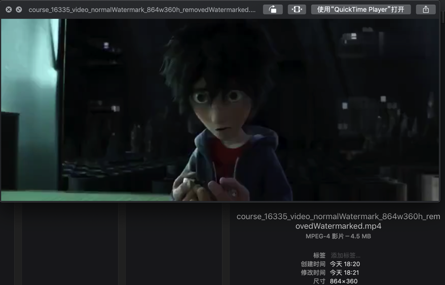
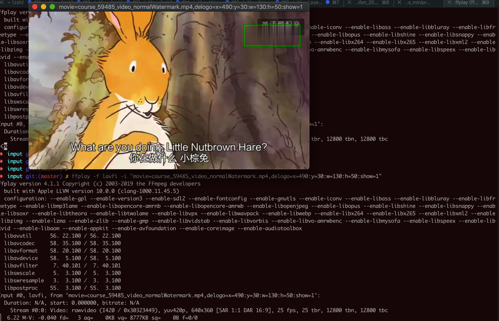

# 去除视频水印

用ffmpeg去除视频水印

举例：

```bash
ffmpegCmd=ffmpeg -i course_16335_video_normalWatermark_864w360h.mp4 -vf "delogo=x=714:y=28:w=130:h=50" -c:a copy course_16335_video_normalWatermark_864w360h_removedWatermarked.mp4
```

参数解释：
* `x`和`y`是以**左上角**为原点的坐标
* `w`和`h`是水印的矩形区域的宽度和高度

效果：

* 去水印前
  * 
* 去水印后
  * 

## 调试：如何确定水印的区域

另外，在去除水印之前，可以借助于ffplay去播放，给水印区域加上绿色框：

```bash
ffplay -f lavfi -i "movie=video_file.mp4,delogo=x=11:y=22:w=33:h=44:show=1"
```

便于识别水印位置对不对。

举例：

```bash
ffplay -f lavfi -i "movie=course_59485_video_normalWatermark.mp4,delogo=x=490:y=30:w=130:h=50:show=1"
```

可看到右上角的区域，加上了绿色边框：



可以看出水印矩形区域的位置明显不对，和希望的位置有偏差，然后继续去调整`x`、`y`、`w`、`h`参数即可。
